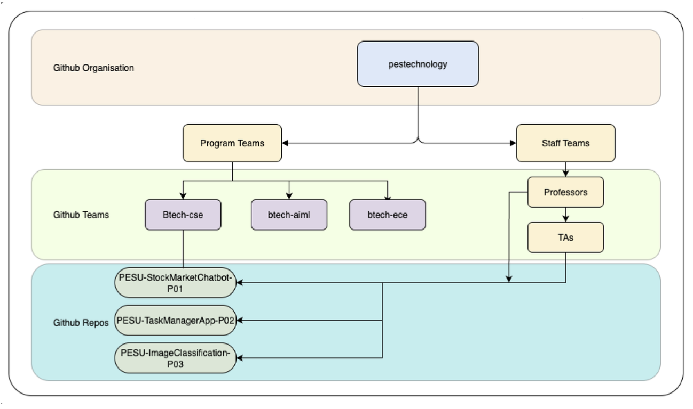

<!-- PES University Campus Source - GitHub Enterprise README -->
<p align="center">
  
</p>
<h1 align="center">PES University Campus Source</h1>
<p align="center">
  <strong>GitHub Enterprise for Academic Excellence</strong><br/>
  <a href="https://pes.edu/">Official Website</a> |
  <a href="https://www.linkedin.com/school/pes-university/">LinkedIn</a> |
  <a href="https://twitter.com/pesuniversity">Twitter</a> |
  <a href="index.html">Campus Source Portal</a>
</p>

---

## 🏛️ About Campus Source

Welcome to **Campus Source** - PES University's centralized GitHub Enterprise platform that enables secure code collaboration, version control, and project management across all academic programs, research initiatives, and institutional projects.

Campus Source serves as the technology backbone for our vibrant campus community of **15,000+ students, faculty, and staff**, providing a unified environment for:
- 🎓 **Academic Projects** – Course assignments, capstone projects, and collaborative development
- 🔬 **Research Initiatives** – Faculty-led research, student research projects, and interdisciplinary collaboration
- 🏢 **Institutional Development** – Administrative tools, campus applications, and infrastructure projects
- 🤝 **Industry Partnerships** – Collaborative projects with industry mentors and external organizations

---

## 📋 Organization Structure

Our GitHub Enterprise follows a hierarchical team structure that mirrors PES University's academic organization:

```
pestechnology (GitHub Organization)
├── Program Teams
│   ├── btech-cse (B.Tech Computer Science)
│   ├── btech-aiml (B.Tech AI & ML)
│   ├── btech-ece (B.Tech Electronics)
│   ├── mtech-* (M.Tech Programs)
│   └── mba (MBA Programs)
├── Staff Teams
│   ├── professors (Faculty Members)
│   └── teaching-assistants (TAs)
└── Project Repositories
    ├── PESU-ProjectName-P01
    ├── PESU-ProjectName-P02
    └── PESU-ProjectName-P03
```

### Repository Naming Convention
All repositories follow the standardized format: `PESU-<ProjectName>-<ProjectId>`

**Examples:**
- `PESU-StockMarketChatbot-P01`
- `PESU-TaskManagerApp-P02`
- `PESU-ImageClassification-P03`

---

## 🚀 Getting Started

### For Students
1. **Create Account**: Sign up at [GitHub](https://github.com) using your `@pes.edu` email
2. **Join Organization**: Accept invitation to "pestechnology" organization
3. **Enable 2FA**: Set up two-factor authentication (mandatory)
4. **Complete Profile**: Add your program, year, and department information
5. **Join Team**: Get added to your program-specific team by your instructor

📖 **Detailed Guide**: [Campus Source Onboarding](onboarding-guide.html)

### For Faculty
1. **Account Setup**: Create GitHub account with PES credentials
2. **Team Assignment**: Join professors team and relevant program teams
3. **Repository Management**: Create and manage course repositories
4. **Security Training**: Complete mandatory security awareness training

📚 **Faculty Resources**: [Campus Source Help Guide](campus-source-help.html)

---

## 🛠️ Services & Tools

### Core Platform Features
- **Repository Hosting** – Unlimited private repositories for all PES projects
- **Team Collaboration** – Structured access control and permissions management
- **Security Features** – Dependabot alerts, secret scanning, and vulnerability management
- **CI/CD Integration** – GitHub Actions for automated testing and deployment
- **Project Management** – Issues, pull requests, and project boards

### Educational Programs
- 📖 **[GitHub Bootcamp](github-bootcamp.html)** – 4-week intensive training program
- 🎯 **Code Review Workshops** – Best practices for collaborative development
- 🔒 **Security Training** – Cybersecurity awareness and secure coding practices
- 🏆 **Certification Programs** – PES GitHub Proficiency Certificates

### Support Services
- **24/7 IT Help Desk** – `ithelp@pes.edu` | +91-80-2677-2534
- **Campus Source Portal** – [Comprehensive documentation and guides](index.html)
- **Training Resources** – Video tutorials, documentation, and workshops
- **Community Support** – Peer-to-peer learning and mentorship programs

---

## 📊 Platform Statistics

<div align="center">

| Metric | Value |
|--------|-------|
| **Active Users** | 15,000+ |
| **Repositories** | 5,000+ |
| **Program Teams** | 20+ |
| **Projects Completed** | 2,500+ |
| **Uptime** | 99.9% |

</div>

---

## 🔐 Security & Compliance

Campus Source maintains the highest standards of information security:
- **Mandatory 2FA** for all users
- **Branch Protection** rules on all repositories
- **Automated Security Scanning** for vulnerabilities and secrets
- **Regular Audits** of permissions and access controls
- **Incident Response** procedures for security events

🚨 **Security Emergency**: `security-emergency@pes.edu` | +91-80-2677-2534

---

## 🏆 Success Stories

### Student Projects
- **AI-Powered Healthcare Platform** – Winner of National Innovation Challenge 2024
- **Smart Campus IoT System** – Implemented across all PES campuses
- **Fintech Mobile App** – 10,000+ downloads, featured in app stores

### Research Initiatives
- **Machine Learning Research** – 50+ published papers with code repositories
- **Robotics Lab Projects** – Open-source contributions to global robotics community
- **Sustainability Tech** – Green campus solutions developed and deployed

### Industry Collaborations
- **Microsoft Partnership** – Cloud-native application development
- **Google AI Research** – Collaborative machine learning projects
- **Startup Incubation** – 25+ student startups launched with Campus Source projects

---

## 📱 Key Initiatives

- 🌐 **Digital Transformation** – Campus-wide technology modernization
- 🤖 **AI/ML Center of Excellence** – Advanced research and development
- 🏗️ **Smart Campus Project** – IoT-enabled intelligent infrastructure  
- 🌱 **Sustainability Tech** – Green technology and environmental solutions
- 🚀 **Innovation Hub** – Entrepreneurship and startup development

---

## 📞 Contact & Support

### General Support
- **Email**: [ithelp@pes.edu](mailto:ithelp@pes.edu)
- **Phone**: +91-80-2677-2534 (24/7)
- **Location**: IT Service Center, Ground Floor, Main Building
- **Hours**: 24/7 online support, In-person M-F 9am-5pm

### Campus Source Specific
- **Portal**: [Campus Source Documentation](index.html)
- **Bootcamp**: [github-bootcamp@pes.edu](mailto:github-bootcamp@pes.edu)
- **Training**: [Monthly workshops and certification programs](github-bootcamp.html)

### Connect With PES
- **Website**: [https://pes.edu](https://pes.edu)
- **LinkedIn**: [PES University](https://www.linkedin.com/school/pes-university/)
- **Twitter**: [@pesuniversity](https://twitter.com/pesuniversity)
- **YouTube**: [PES University Channel](https://www.youtube.com/user/pesuniversity)

---

## 📜 Policies & Guidelines

- 📋 [Acceptable Use Policy](acceptable-use-policy.html)
- 🔒 [Security Best Practices](security.html)
- 👥 [Team Management Guidelines](campus-source-help.html)
- 🎓 [Academic Integrity Standards](academic-integrity.html)
- 🤝 [Collaboration Guidelines](collaboration-guidelines.html)

---

<div align="center">

### 🎯 Our Mission
**To empower the PES University community through innovative technology solutions, exceptional support services, and robust infrastructure that enhances teaching, learning, research, and administrative operations.**

</div>

---

<p align="center">
  
</p>

<p align="center">
  <strong><em>Campus Source: Where Innovation Meets Collaboration</em></strong><br/>
  <em>Empowering students. Enriching society. Enabling excellence.</em>
</p>

---

<div align="center">

**🔗 Quick Links**
[Get Started](get-started.html) • 
[Documentation](campus-source-help.html) • 
[Training](github-bootcamp.html) • 
[Support](request-help.html) • 
[Security](security.html)

</div>
